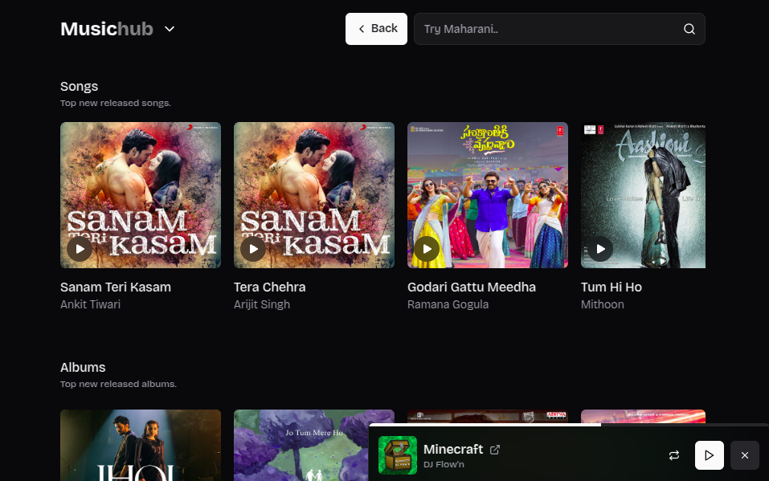
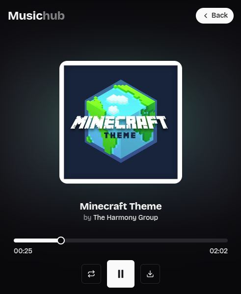
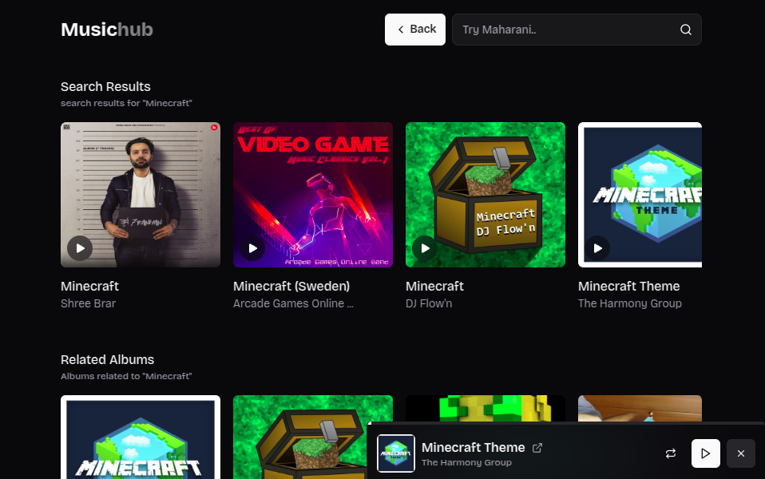

<div align="center">
  
  <h1>Arise</h1>
  <p><strong>Unleash the Sound from the Abyss</strong></p>
  <p>A dark, demon-themed music streaming app powered by JioSaavn + YouTube.</p>

  [](https://nextjs.org)
  [](https://react.dev)
  [](LICENSE)
</div>

---

## Features

- 🎵 **JioSaavn streaming** — millions of songs, albums & artists
- 🔴 **YouTube integration** — search, stream audio or video from YouTube
- 🎭 **Unified player** — one bar controls both Saavn audio & YouTube
- 🎬 **Audio/Video toggle** — switch between audio-only and video for YouTube
- 📋 **Playlist import** — connect Google/Spotify and import your playlists
- 🔒 **OAuth login** — Google (YouTube) and Spotify authentication
- 🌑 **Devil/Demon theme** — immersive dark aesthetic throughout
- 📱 **PWA ready** — installable on iOS & Android
- ⌨️ **Keyboard shortcuts** — Space (play/pause), M (mute), L (loop)

## Screenshots

| Home | Player | Playlists |
|------|--------|-----------|
|  |  |  |

## Setup

### 1. Clone & install

```bash
git clone <your-repo>
cd arise
npm install
```

### 2. Configure environment

```bash
cp .env.example .env.local
# Edit .env.local with your API keys
```

### 3. Required keys

| Key | Where to get it |
|-----|----------------|
| `NEXT_PUBLIC_RAPIDAPI_KEY` | [rapidapi.com/ytjar/api/yt-api](https://rapidapi.com/ytjar/api/yt-api) |
| `NEXT_PUBLIC_GOOGLE_CLIENT_ID` + `GOOGLE_CLIENT_SECRET` | [Google Cloud Console](https://console.cloud.google.com) |
| `NEXT_PUBLIC_SPOTIFY_CLIENT_ID` + `SPOTIFY_CLIENT_SECRET` | [Spotify Developer Dashboard](https://developer.spotify.com/dashboard) |

### 4. Run

```bash
npm run dev
# Open http://localhost:3000
```

## OAuth Setup

### Google (YouTube playlists)

1. Create a project at [console.cloud.google.com](https://console.cloud.google.com)
2. Enable **YouTube Data API v3**
3. Create **OAuth 2.0 Client ID** (Web Application)
4. Add redirect URI: `http://localhost:3000/api/auth/google/callback`

### Spotify (playlist import)

1. Create an app at [developer.spotify.com/dashboard](https://developer.spotify.com/dashboard)
2. Settings → Redirect URIs → Add: `http://localhost:3000/api/auth/spotify/callback`

## Tech Stack

- **Framework**: Next.js 15 (App Router)
- **UI**: React 19, Tailwind CSS, Radix UI, Lucide Icons
- **Audio**: JioSaavn unofficial API via [saavn.sumit.co](https://saavn.sumit.co)
- **Video**: YouTube Embed + IFrame API via RapidAPI
- **Auth**: Google OAuth 2.0 + Spotify OAuth 2.0
- **Deployment**: Vercel

## Keyboard Shortcuts

| Key | Action |
|-----|--------|
| `Space` | Play / Pause |
| `M` | Mute / Unmute |
| `L` | Toggle Loop |
| `Shift + →` | Skip forward 10s |
| `Shift + ←` | Skip back 10s |

## Legal

This app is for **educational purposes only**. It uses unofficial/public APIs.  
All music rights belong to their respective owners.

---

<div align="center">
  Made with 🔥 by the Arise team
</div>
